# Android App Development

This repository showcases a diverse range of Android app projects, each crafted with care to demonstrate various aspects of mobile app development. The projects are implemented using **Java** programming language and **XML** for layout design within the **Android Studio IDE**.

Explore the repository to delve into the intricacies of each project and discover the innovative solutions implemented to tackle different challenges.

---

## Project Q1 - Hello World

### Description
Can't function without a Hello World project :)

### Preview
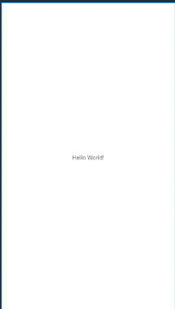

---

## Project Q2 - Car Loan EMI Calculator

### Description
The Car Loan EMI Calculator is a user-friendly Android application designed to assist users in quickly and efficiently calculating their Equated Monthly Installments (EMI) for car loans. This project highlights the implementation of Buttons, Input fields, image buttons, and table grids.

### Preview
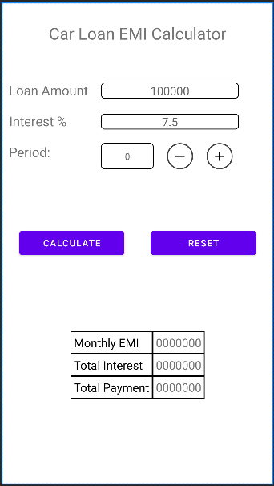

---

## Project Q3 - LoginApp

### Description
This project provides a fundamental implementation of a secure and user-friendly login functionality for Android.

### Preview
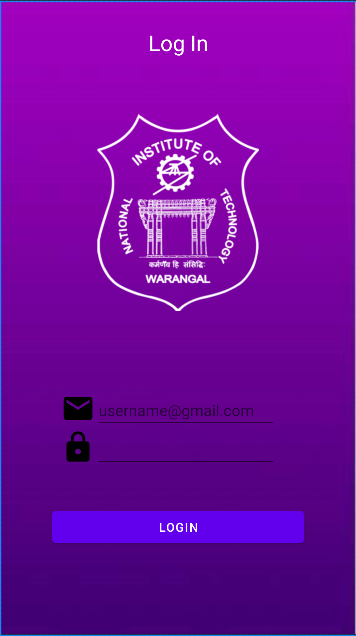

---

## Project Q4 - MenuApp

### Description
The MenuApp project offers a seamless navigation experience with a two-option menu—'Product' and 'Contact Details.' Users can effortlessly switch between screens by selecting their desired option, revealing dedicated pages for exploring product information or accessing contact details. This project showcases efficient screen transitioning and demonstrates the implementation of a user-friendly menu system in Android applications. This project highlights the implementation of a menu and navigation between screens.

### Preview
| Home | Menu Options | Products | Contact |
|---------------|---------------|---------------|---------------|
| 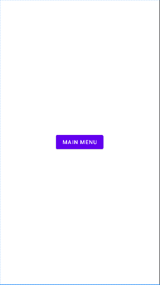 | 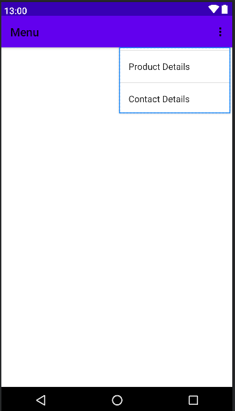 | 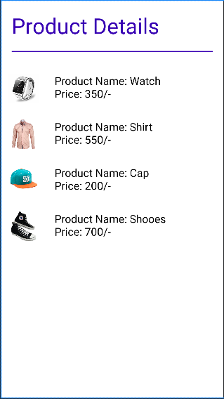 | 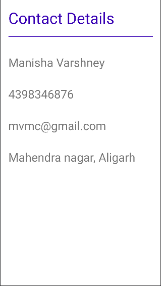 |

---

## Project Q5 - Movie Rating App

### Description
The MovieRatingApp is a user-friendly application designed for movie enthusiasts. With a dropdown menu containing a curated list of movies and an interactive rating bar, users can easily select a movie, rate it using the intuitive interface, and submit their ratings. Upon submission, the app provides immediate feedback with a toast message, displaying the selected movie and the corresponding rating. 

This project highlights the implementation of dropdown menus, rating bars, and toast notifications for a delightful movie rating experience on Android.

### Preview
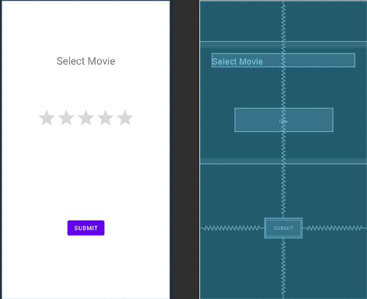

---

## Project Q6 - Student progress Tracker

### Description
The StudentProgressTracker app enables users to track student progress in different sections (A, B, C, D). Utilizing a seek bar and radio buttons, users can set progress percentages and select student sections. Upon submission, a toast message displays the chosen section and progress, offering a straightforward and interactive tool for monitoring student advancement.

The project highlights the implementation of the Seek bar for progress tracking, Radio buttons for selecting student sections, Dynamic updates to the display based on seek bar changes, Toast notifications for providing feedback on the selected section, and progress percentage.

### Preview
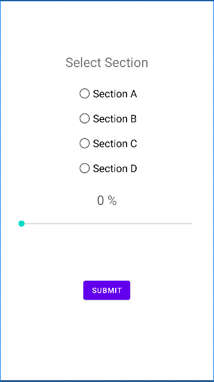

---

## Project Q7 - Distance App

### Description
The DistanceCalculatorApp simplifies travel time estimation with an Android interface featuring image buttons for effortless source-destination swapping and chips representing transportation modes like car, bike, train, and walking. Users input locations through EditText fields, and the app dynamically updates TextViews to display estimated travel times. 

This project showcases the implementation of image buttons, chips, and other UI components for an intuitive and interactive distance calculation experience.

### Preview
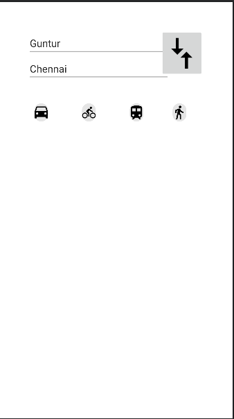

---

## Project Q8 - Bill Converter App

### Description
The BillConverterApp facilitates currency conversion with a simple interface. Users input the bill amount, select a conversion rate (500, 100, 1000) using radio buttons, and receive the converted amount in rupees with a press of a button. This app streamlines currency-related calculations, providing users with a quick and efficient tool.

The project highlights the implementation of User input handling for bill amount, Radio buttons for selecting different currency conversion rates, Dynamic updates to the display based on user selections, Currency conversion, and display of the converted bill amount in rupees.

### Preview
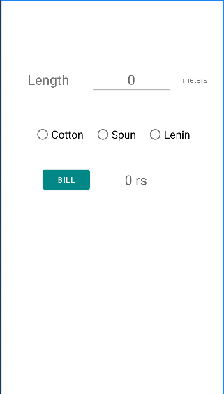

---

## Project Q9 - CurrencyConverterApp

### Description
CurrencyConverterApp simplifies currency conversion. Users input rupees, choose a conversion rate (0.01225, 0.01113, 1.635) with radio buttons, and instantly view the converted amount. This app offers a swift and user-friendly tool for converting rupees into other currencies.

The project highlights User input for the rupee amount, Radio buttons for selecting conversion rates, and Dynamic display of the converted amount.

### Preview
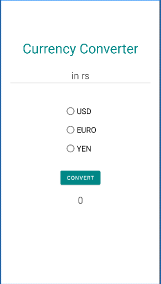

---

## Project Q10 - Home Security App

### Description
HomeSecurityApp offers quick toggles for managing house security – alarm, main door, and gate. Users control each feature independently with visual status indicators for seamless monitoring. Demonstrates different types of toggles that can be implemented.

### Preview
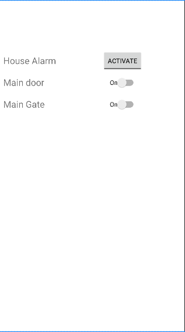

---

## Project Q11 - Shape Drawer App

### Description
The ShapeDrawerApp utilizes Android's Canvas and Bitmap to create a dynamic drawing interface. This app demonstrates the implementation of fundamental graphic elements, including rectangles, circles, squares, and lines. The Canvas object is used to draw these shapes with specified dimensions and positions, while the Paint object defines their color and text characteristics. The resulting bitmap serves as the background for an ImageView, showcasing a simple yet effective graphical representation of shapes with associated labels.

---

## Project Q12 - Appointment Scheduler App

### Description
The AppointmentSchedulerApp facilitates easy appointment scheduling with the following features:

- User input fields (`EditText`) for name, email, contact number, and additional details.
- Radio buttons (`RadioButton`) for selecting gender (Male/Female).
- Date and time pickers for choosing appointment details.
- Spinners (`Spinner`) for selecting medical specialization and doctor names dynamically.
- A button (`Button`) to submit the appointment details and navigate to the next screen.

Upon submission, the app collects and passes the user's information to the next activity, ensuring a smooth and organized appointment scheduling process.

**Project highlights the implementation of:**
- User input fields for personal and appointment details.
- Dynamic spinners for medical specialization and doctor names.
- Date and time pickers for selecting appointment details.
- Gender selection using radio buttons.
- Intent for passing data to the next activity.

### Preview
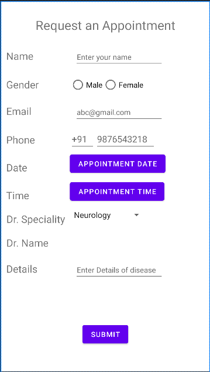

---

## Project Q13 - Student Info App

### Description
Student Info App simplifies data entry for student details with intuitive input fields for name, roll number, branch, specialization, and subjects. Users select the course (UG/PG) using radio buttons, dynamically generating text fields based on the chosen course with a spinner. The app efficiently collects and passes student information through an intent for a streamlined and user-friendly data entry process. (multiple activities)

### Preview
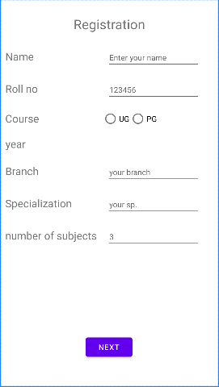

---

## Project Q14 - Async Task Example

### Description
The Async Task Example showcases the practical use of Android's AsyncTask for asynchronous background tasks. The main activity, `MainActivity`, features a TextView displaying messages and a button initiating the asynchronous task. The `SimpleAsyncTask` class extends AsyncTask, simulating a time-consuming operation with a random sleep duration. The app handles screen rotation, ensuring a smooth user experience by saving and restoring the TextView's state. This project demonstrates the implementation of AsyncTask for background tasks with UI updates in an Android application.

### Preview
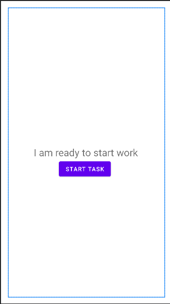

---

## Project Q15 - Alert Example

### Description
The Alert Example project illustrates the implementation of an AlertDialog in Android. The `MainActivity` class, extending AppCompatActivity, creates an AlertDialog with a title, message, and two buttons (OK and Cancel). Clicking these buttons displays corresponding Toast messages. This concise app provides a clear example of incorporating AlertDialog functionality in an Android application.

### Preview
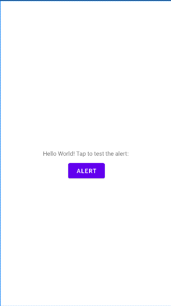

---

## Need any help?
##### Connect me on [LinkedIn](https://www.linkedin.com/in/manisha-varshney-914646191/)   

Thank you for exploring our Android app development repository! If you have any questions or feedback, please don't hesitate to reach out.
